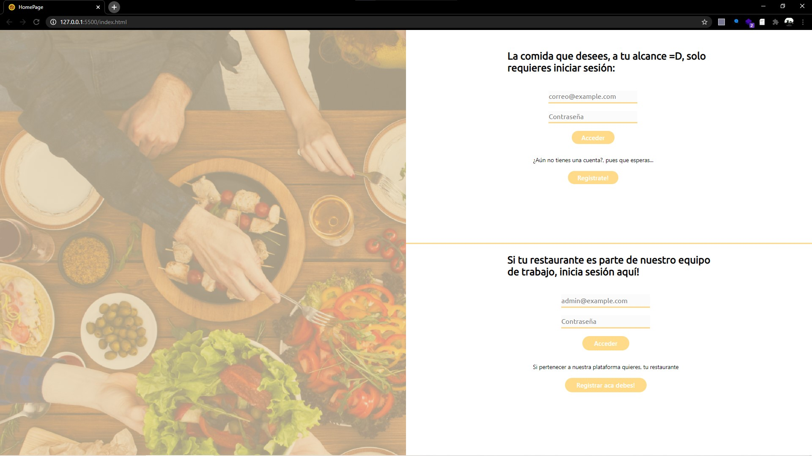
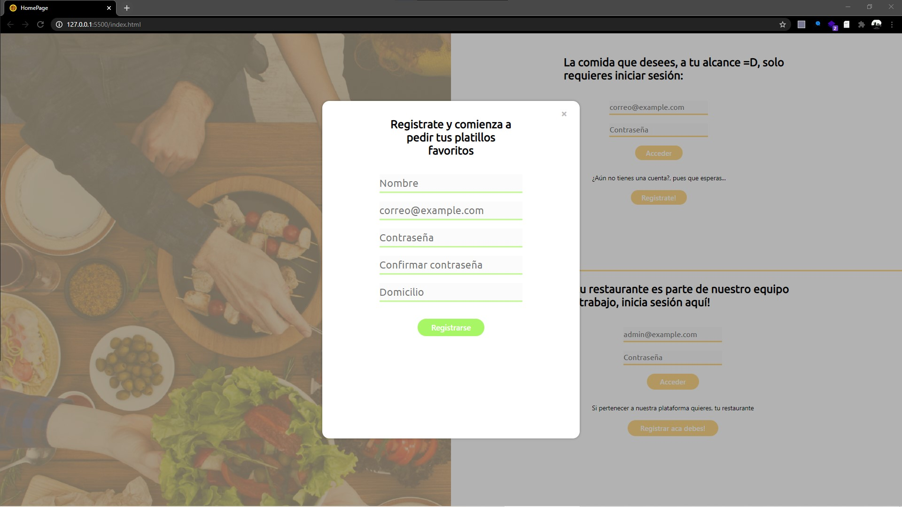
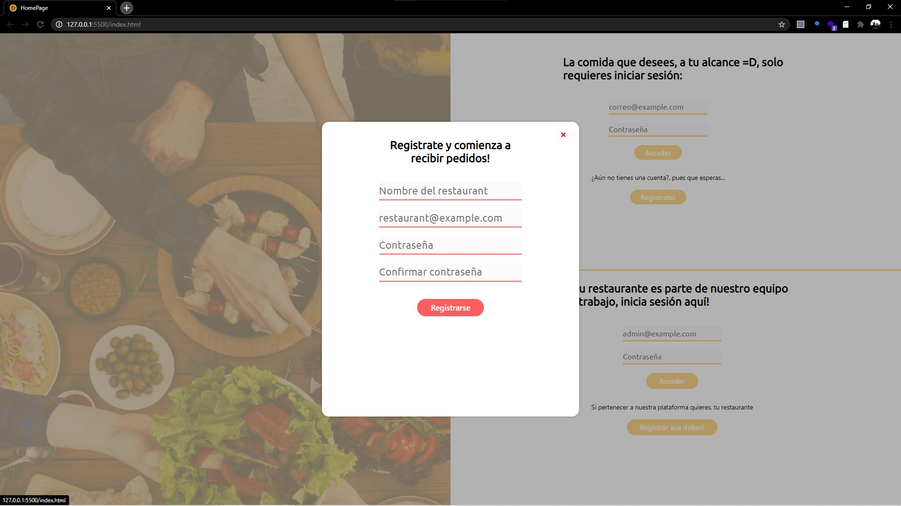
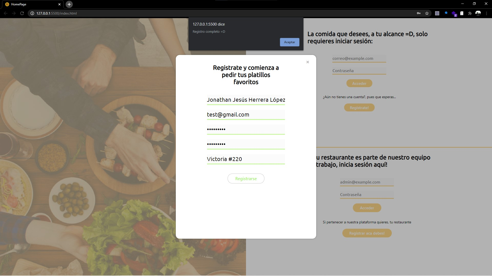
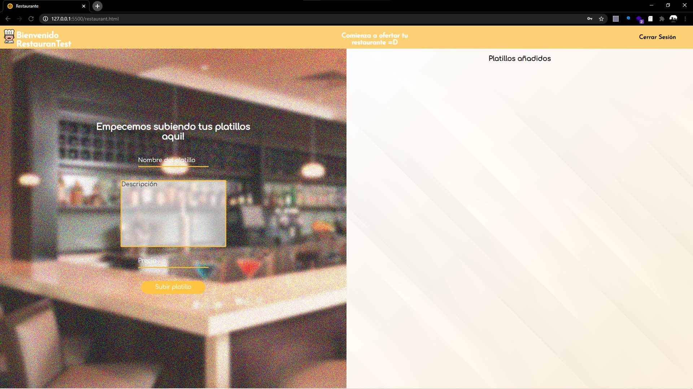
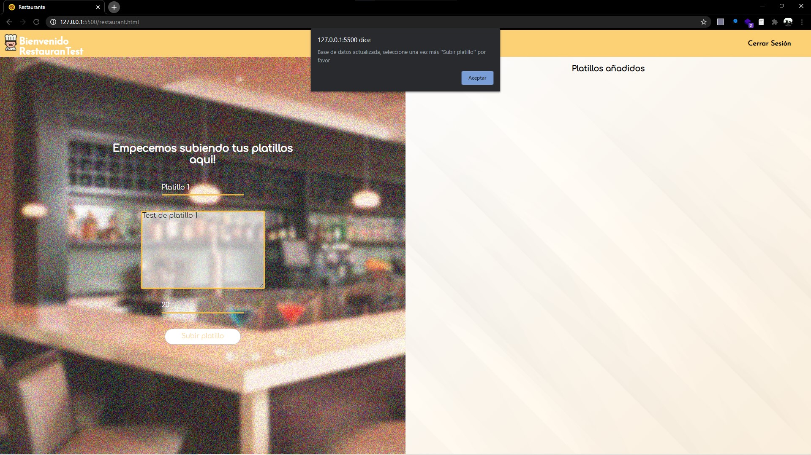
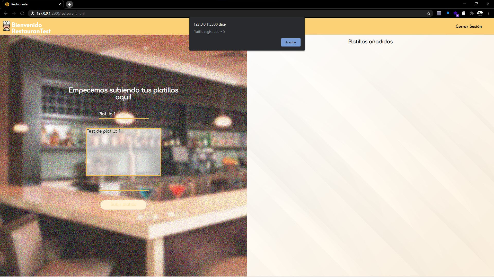
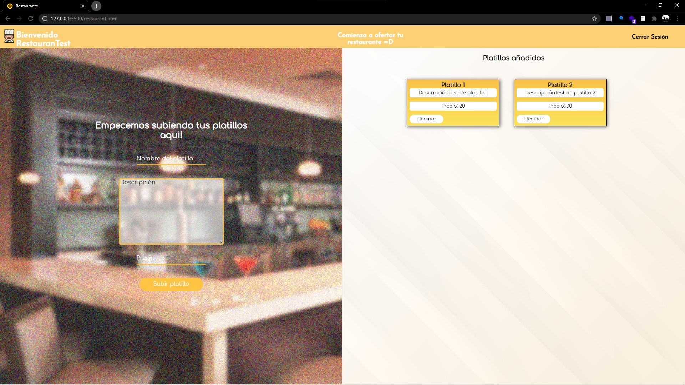
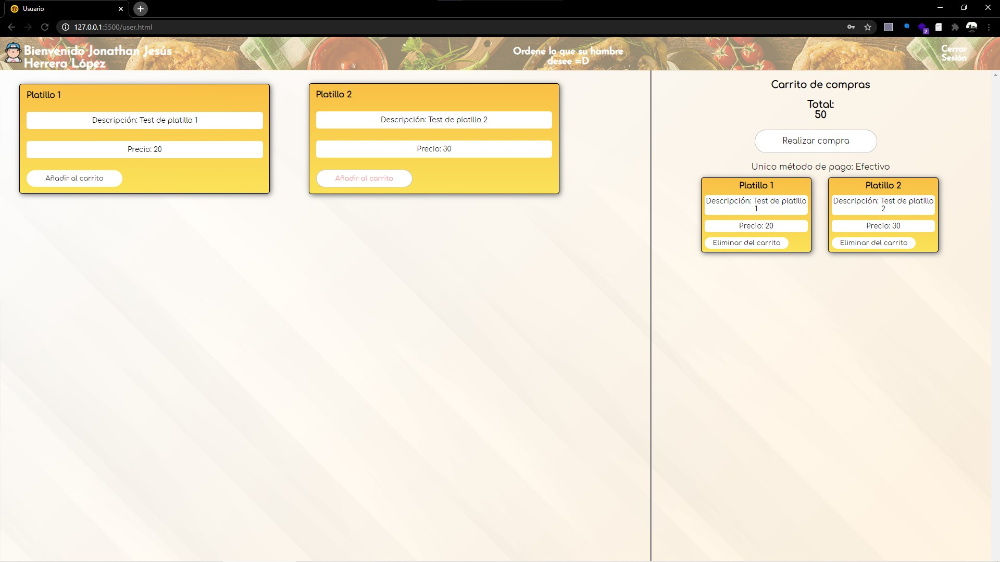
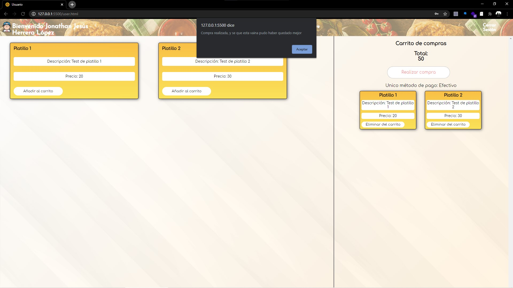

# Alfas1.0
1st semester final project of Development Center Group (Grupo: "Centro de Desarrollo" de mi Universidad), this is a simple website made with html, css and javascript using localstorage as a "database". By the simplicity of this project this is not use a responsive web design, and i made it in a resolution of 1080, so i'll put the next screenshots from the same, obviusly you can try the site in your computer, but you will need reduce the zoom of your navigator.

<!-- 

 -->

## Postscript
My strength is not the design as it can be appreciated, so I always try to focus on functionality 😅